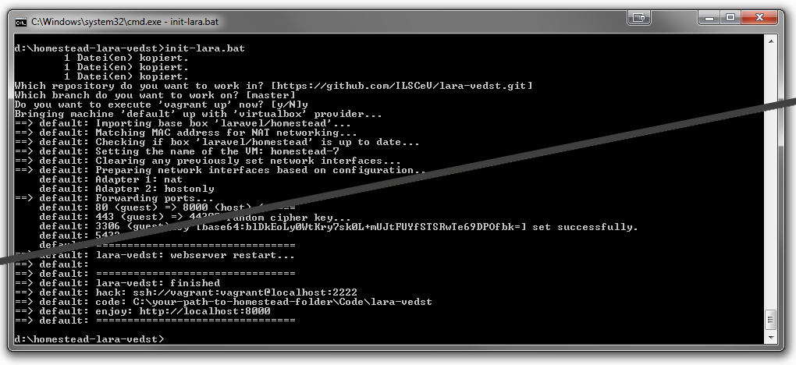

# homestead-lara-vedst

This project provides a vagrant machine for development on the [ILSCeV/Lara](https://github.com/ILSCeV/Lara) calender and personnel scheduling tool.

## tl;dr

1. Install Git ([Windows](https://git-for-windows.github.io))
2. Install [VirtualBox 5.1](https://www.virtualbox.org/wiki/Downloads)
3. Install [Vagrant 1.9+](https://www.vagrantup.com/downloads.html)
4. Open a console (Powershell, Git Bash, Terminal, ...)
 1. `git clone https://github.com/ILSCeV/homestead-lara-vedst.git`
 2. `cd homestead-lara-vedst`
 3. `init-lara.bat` / `init-lara.sh`
 4. `vagrant up`
5. Your Lara Source Code in folder "homestead-lara-vedst/Code"
6. Your Lara Website: [http://localhost:8000](http://localhost:8000)
7. (Use `restart-vm.bat` to restart the machine, if needed or after booting the host system)
8. (Use `destroy.bat` to reset)

## The details

1. Git will be used to download this project and you will use it later to push changes.
2. VirtualBox will be used as a virtualisation driver by Vagrant. You will not interact with it directly.
3. Vagrant is a nifty tool to make creating and setting up a virtual machine a piece of cake. All you really need is one script file (`Vagrantfile`) which describes how the virtual machine should look and feel (OS, packages, mounts, network, portforwardings,...), the rest is done by Vagrant. magic.
4. Choose any console you like.
 1. This step downloads this project. It is based on [homestead](https://laravel.com/docs/master/homestead), the official Laravel Vagrant-based development environment. The only modifications are in the files `Homestead.yaml` and `after.sh`.
 2. a not so complicated step.
 3. this will create copies of `Homestead.yaml` and `after.sh` for execution in your personal user folder. Additionally you you will be prompted for the repository and branch to clone from.
 4. This will take some minutes and you will probably get some easily solvable errors. Check out other [useful commands for Vagrant](http://www.erikaheidi.com/blog/quick-user-guide-for-vagrant). That's what happens:
     - Downloads the homestead virtual box.
     - The box will be configured according to the `Homestead.yaml` in your personal folder.
     - The box will boot and at first execute a "provisioner", the script `after.sh` in your personal folder.
     - The script will download the latest lara-vest source code and will initialize the database.
     - After the execution was successful, the virtual machine is active in the background. You can connect and interact with it as with any other virtual machine, you don't have to though.
5. Do your modifications here, the folder is autosynced with the virtual machine
6. **Tadaaa**
7. The script will basically just power down the VM with `vagrant halt` (if currently booted) and (re-)boot the VM with `vagrant up`.
8. The script will destroy the VM, delete the temporary files and delete your vagrant Code content. Caution: all unpushed changes to your Lara repository will be lost.

## Windows, Linux, OSX
The setup was tested under Windows 7 x64 but is supposed to be platform independant.

## Note on upgrades
`homestead-lara-vedst` is based on [`homestead`](https://github.com/laravel/homestead) and the [Homestead Vagrant Box](https://atlas.hashicorp.com/laravel/boxes/homestead).

Both projects are upgraded regulary and because `homestead` as well as `homestead-lara-vedst` always utilize the latest version of the Homestead Vagrant Box and additional external libraries, `homestead-lara-vedst` can behave faulty at any point.
A merge of changes done in `homestead` will be needed!

Please open an issue if you believe that an upgrade is needed.
